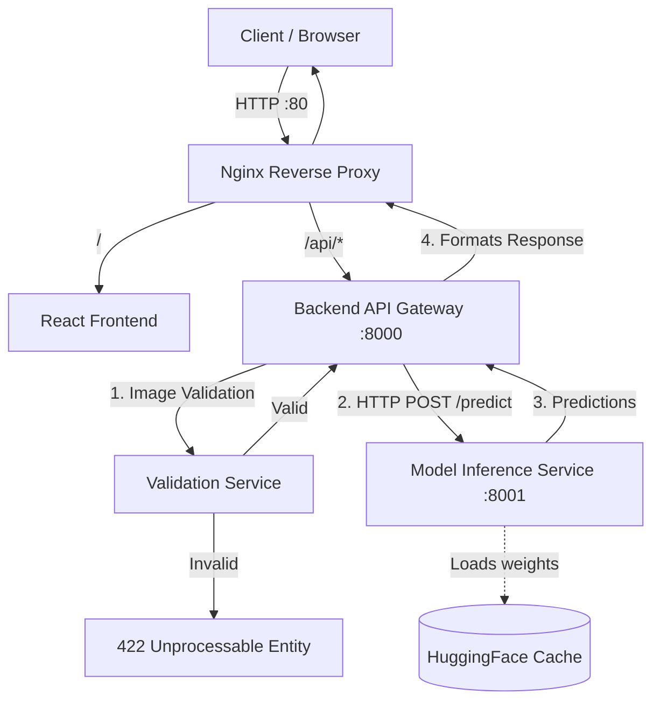

# System Architecture

This document outlines the high-level system architecture and data flow of the Retinal Disease Classifier.

## Overview

The application has been upgraded from a standalone FastAPI backend into a robust, Dockerized microservices architecture. This separation of concerns allows for independent scaling, better resource allocation (especially GPU isolation), and a cleaner development lifecycle.

## Core Microservices

### 1. Nginx Reverse Proxy (`nginx/`)
- **Role**: Public-facing entry point (Port 80/443).
- **Function**: Routes traffic appropriately between the frontend and the backend API based on the URL path.
- **Security**: Ensures that internal services (like the GPU Model Service) are not exposed directly to the outside world.

### 2. React Frontend (`services/frontend/`)
- **Role**: User Interface.
- **Function**: A Single Page Application (SPA) built with React/Vite that allows users to seamlessly upload fundus images and view inference results.

### 3. Backend API Gateway (`services/backend/`)
- **Role**: Request Orchestration & Validation (Port 8000).
- **Function**: 
  - Validates incoming requests.
  - Implements the [Validation Service](VALIDATION_SERVICE.md) to heuristically filter out non-fundus images.
  - Manages overarching business logic, cross-origin resource sharing (CORS), and standardized API error formatting.
  - Forwards valid requests to the underlying Model Service.

### 4. Model Inference Service (`services/model/`)
- **Role**: Deep Learning Inference Engine (Port 8001).
- **Function**: 
  - Dedicated service for running the EfficientNet-B4 PyTorch model.
  - Exclusively reserves system GPU(s) via NVIDIA Container Toolkit.
  - Runs with a **single worker** (`MODEL_SERVICE_WORKERS=1`) to prevent GPU Out-of-Memory (OOM) errors that would occur if multiple processes tried to load the model simultaneously.
  - Utilizes a persistent HuggingFace cache volume to avoid re-downloading model weights on restart.

---

## Request Flow

## Docker Configuration

The application ecosystem is defined in `docker-compose.yml`:
- **Networking**: Relies on a private bridge network (`app-network`).
- **Volumes**: A named volume (`hf-cache`) is mounted to `/app/.cache/huggingface` in the model service, ensuring fast startups.
- **GPU Passthrough**: Configured via the `deploy` key, reserving all available `nvidia` devices.
