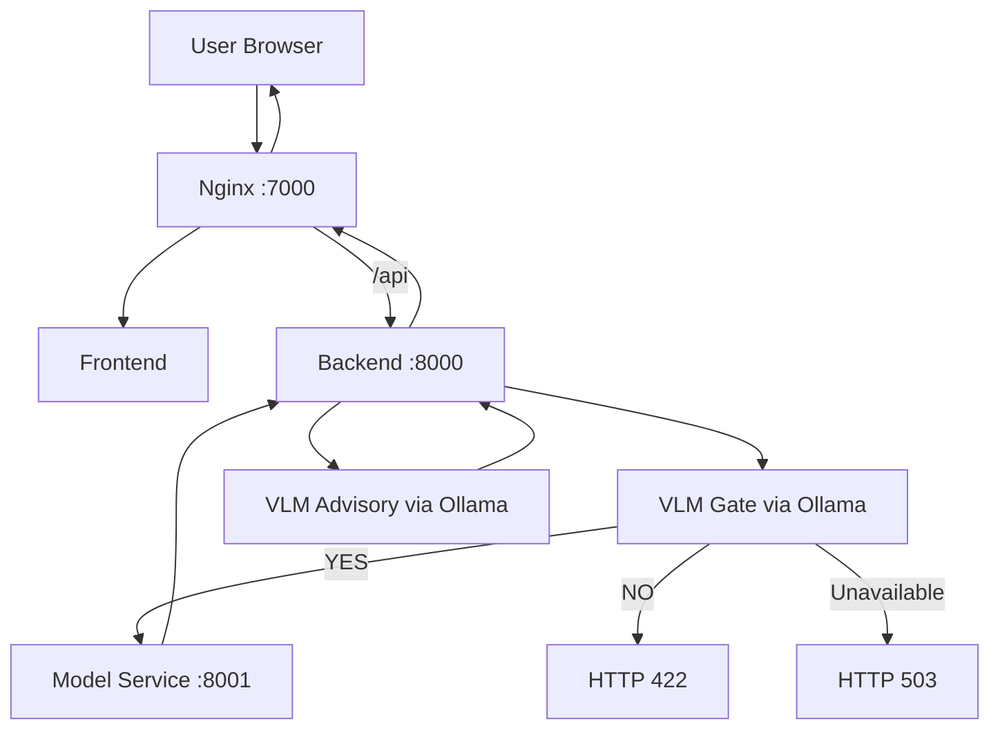

# System Architecture

This project runs as a containerized microservice system with local VLM support through Ollama.

## Service Topology

- `nginx`: public entry point and reverse proxy
- `frontend`: React single-page app
- `backend`: FastAPI orchestration and business logic
- `model-service`: EfficientNet-B4 inference service
- `ollama`: local vision-language model runtime
- `ollama-pull`: one-shot model pull init container

## Network Roles

- Public traffic enters through `nginx` on host port `7000`.
- Internal calls use Docker service DNS on the shared app network.
- `model-service` is internal only (`http://model-service:8001`).
- `ollama` is internal for backend (`http://ollama:11434`) and optionally exposed on host `11434`.

## End-to-End Request Flow

## Validation and Inference Contract

The backend enforces this sequence:

1. Upload size and file-level checks.
2. VLM eye-image gate.
3. CNN inference for 45 disease labels.
4. Static advisory generation.
5. Optional VLM personalized advisory enrichment.

Gate behavior is strict by default:

- Explicit non-eye result: reject with `422`.
- Gate unavailable after retries: reject with `503`.

Advisory enrichment is fail-open:

- If stage-2 VLM fails, backend returns static advisory text.

## Deployment Variants

- `docker-compose.yml`: full stack with GPU-ready model-service.
- `docker-compose.cpu.yml`: standalone CPU mode with same service shape.
- `docker-compose.override.yml`: local overrides on top of main compose.

## Core Source Paths

- `services/backend/src/routers/predict.py`
- `services/backend/src/services/vlm_service.py`
- `services/backend/src/config.py`
- `services/model/src/main.py`
- `docker-compose.yml`
- `docker-compose.cpu.yml`
